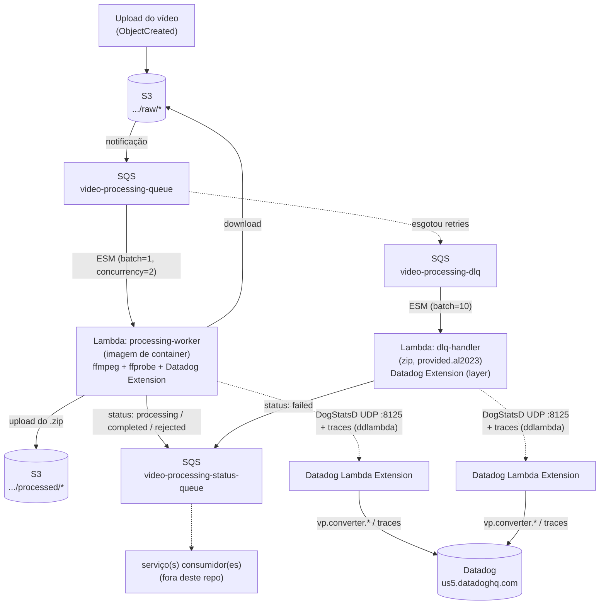

# video-processor-converter

Serviço `processing-worker` do desafio de processamento de vídeos (13SOAT / Andromeda).

## O que a aplicação faz

1. Um vídeo é enviado para `s3://<bucket>/<linkId>/raw/<arquivo>`.
2. O evento `ObjectCreated` do S3 cai na fila `video-processing-queue`, que dispara a Lambda **`processing-worker`** (Event Source Mapping, batch de 1).
3. O worker: baixa o vídeo, valida a resolução via `ffprobe` (até 1920x1080 — maior é rejeitado com `invalid_resolution`), extrai 1 frame/segundo com `ffmpeg`, compacta os frames em `.zip`, publica o `.zip` de volta em `s3://<bucket>/<linkId>/processed/` e reporta cada etapa (`processing`, `completed`, `rejected`, ...) na fila `video-processing-status-queue`.
4. Mensagens que esgotam as tentativas do worker caem na `video-processing-dlq`, que dispara a Lambda companion **`dlq-handler`** — ela apenas marca o job como falha definitiva na fila de status (não reprocessa o vídeo).
5. As duas Lambdas emitem métricas customizadas (`vp.converter.*`) e traces via Datadog.

## Arquitetura em produção



Buckets, filas e o repositório ECR são provisionados por um repo de infra compartilhado (`iac-video-processor-infra`) e apenas referenciados aqui via `data` sources ([`terraform/data.tf`](terraform/data.tf)) — este repo só gerencia as duas Lambdas ([`terraform/worker.tf`](terraform/worker.tf), [`terraform/dlq.tf`](terraform/dlq.tf)).

## Como rodar local

Requisitos: Docker + Docker Compose, Go 1.25, ffmpeg/ffprobe no PATH.

> O `docker-compose.yml` usa `localstack/localstack-pro` — é preciso um `LOCALSTACK_AUTH_TOKEN` válido no `.env` (o CI, que só usa S3+SQS, contorna isso rodando a imagem free-tier direto via `docker run`, sem passar pelo compose).

```bash
cp .env.example .env      # ajustar LOCALSTACK_AUTH_TOKEN e URLs se necessário
make compose-up            # sobe LocalStack (S3+SQS) e cria bucket/filas/notificação
make run-local              # invoker local com long-polling na fila principal

# noutro terminal: subir um vídeo 1080p para disparar o pipeline
aws --endpoint-url=http://localhost:4566 s3 cp test/fixtures/sample_1080p.mp4 \
  s3://video-processor-bucket/lnk_demo/raw/sample_1080p.mp4

# conferir os eventos de status:
aws --endpoint-url=http://localhost:4566 sqs receive-message \
  --queue-url http://localhost:4566/000000000000/video-processing-status-queue --max-number-of-messages 10

# conferir o zip gerado:
aws --endpoint-url=http://localhost:4566 s3 ls s3://video-processor-bucket/lnk_demo/processed/
```

`make run-local-dlq` roda o invoker apontando para a DLQ (testa o `dlq-handler`).

### Testando as métricas do Datadog localmente

O `docker-compose.yml` tem um serviço opcional `datadog-agent` (só DogStatsD ligado — sem APM/logs/process) que recebe as métricas `vp.converter.*` da app local e as encaminha pra conta real do Datadog. Ele **não** sobe com `make compose-up` (fica atrás do profile `datadog`), justamente para não exigir uma API key em quem só quer mexer no S3/SQS.

```bash
# preencher DD_API_KEY no .env (mesma key usada em produção — ver terraform/variables.tf)
make compose-up-dd     # sobe LocalStack + datadog-agent
make run-local          # DOGSTATSD_ADDR já aponta pra 127.0.0.1:8125 por default

# depois de disparar um job (ver seção acima), as métricas aparecem em
# Metrics Explorer, em ~1-2min, filtrando por "vp.converter.*"
```

`make compose-down` derruba tudo, incluindo o `datadog-agent` se estiver no ar.

## Build

```bash
make build          # compila os dois binários (linux/amd64)
make docker-build   # imagem de container do worker (ECR)
make dist-dlq       # gera dist/dlq-handler.zip (deploy via zip)
```

## Observabilidade (Datadog)

Instrumentação em duas frentes, nas duas Lambdas:

- **Traces/APM** — `ddlambda.WrapFunction` (em `cmd/processing-worker/main.go` e `cmd/dlq-handler/main.go`) cria o span raiz da invocação.
- **Métricas customizadas** — cliente DogStatsD ([`internal/adapter/metrics/datadog.go`](internal/adapter/metrics/datadog.go)) com prefixo `vp.converter.`, identificando as métricas desta app entre as demais do org Datadog.

Transporte: as duas Lambdas falam com a **Datadog Lambda Extension** via UDP em `127.0.0.1:8125` (dentro do próprio sandbox da Lambda — não é um container/processo à parte). No worker (imagem) a extension já vem embutida no `Dockerfile` (`COPY --from=public.ecr.aws/datadog/lambda-extension`); no `dlq-handler` (deploy via zip) ela entra via **Lambda Layer** pública (`Datadog-Extension`, ver `terraform/dlq.tf`).

Variáveis de ambiente (definidas pelo Terraform deste repo em `worker.tf`/`dlq.tf`):

| Var | Valor | Notas |
|---|---|---|
| `DD_API_KEY` | `var.dd_api_key` (Terraform, `sensitive = true`) | passada direto pro ambiente da Lambda |
| `DD_SITE` | `us5.datadoghq.com` | site da org Datadog |
| `DD_ENV` | `var.environment` | tag de ambiente (ex.: `prod`) |
| `DD_SERVICE` | `processing-worker` / `dlq-handler` | nome do serviço |
| `DD_VERSION` | tag da imagem / nome do zip | correlaciona deploy ↔ métricas/traces |
| `DD_TRACE_ENABLED` | `true` (prod) / `false` (local, via `.env.example`) | liga/desliga o `ddlambda.WrapFunction` |

Métricas emitidas (namespace `vp.converter.` aplicado automaticamente pelo client):

| Métrica | Tipo | Onde |
|---|---|---|
| `batch.records` / `batch.failures` | count | nos dois handlers, por lote SQS processado |
| `job.completed` / `job.skipped` / `job.rejected{reason:invalid_resolution}` | count | worker, por vídeo processado |
| `download.duration` / `extract.duration` / `zip.duration` / `upload.duration` / `job.duration` | timing | worker, por etapa do pipeline |
| `video.width` / `video.height` / `frames.count` | distribution | worker, por vídeo processado |
| `dlq.exhausted` | count | dlq-handler, após publicar o status de falha definitiva |

Localmente, sem o `datadog-agent` no ar (seção acima), o client tenta mandar UDP para `127.0.0.1:8125`, ninguém escuta, e cada falha de envio vira só um log `warn` — a app continua funcionando normalmente.

## Testes

```bash
make test               # unitários (rápidos, sem rede)
make test-cover         # unitários + cobertura
make test-integration   # integração (requer make compose-up antes)
```
